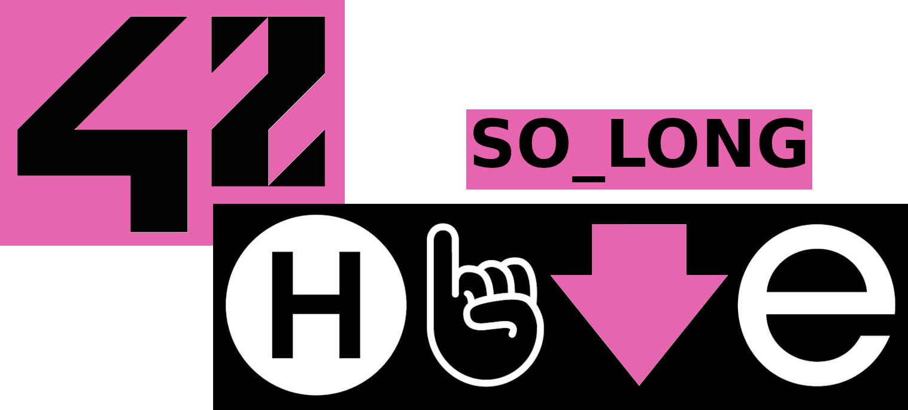

<h1 align="center">
  
</h1>

<p align="center">
	<b><i>Small skeleton themed 2D game 🎮 featuring mlx42.</i></b><br>
</p>

<p align="center">
  
  
	
  
</p>

<p align="center">
    
  
</p>

<div align="center">

## Table of Contents
[📝 General](#-general)
[🛠️ Build](#️-build)
[⚡ Usage](#-usage)
[🚀 Details](#-details)
[♻️ Resources](#️-resources)

</div>

## 📝 General

Goal of the project is to create simple 2D video game.

## 🛠️ Build

GNU `make` and `gcc` are required to build and compile the project.

You also need to install [mlx42](https://github.com/codam-coding-college/MLX42) and all its prerequisites.

⚠️ Game was designed for `linux`. Extra steps might be required for MacOS and Windows. ⚠️

```bash
git clone --recurse-submodules https://github.com/Jarnomer/so_long.git so_long
```

```bash
cd so_long && make all
```

## ⚡ Usage

You can run the game by giving it a map file. Invalid argument or map results into `error`.

```bash
./so_solong maps/<map_name>.ber
```

Goal is to `collect` all gems and then `escape` through exit with least amount of moves.

Be careful! If you take your time the `enemies` start to `multiple`.

## 🚀 Details

[RESERVED]

## ♻️ Resources

[mlx42](https://github.com/codam-coding-college/MLX42) main API used for GLFW and OpenGL functionatilies.

[itch.io](https://itch.io/game-assets/free/tag-sprites) great place to find sprites and other game assets.

[solong-error-tester](https://github.com/Jarnomer/solong-error-tester) personal unit tester for error handling.

## 4️⃣2️⃣ Footer

For my other 42 project and general information, please refer the [landing page](https://github.com/Jarnomer/Hive42).

I have also created error handling [unit testers](https://github.com/Jarnomer/Hive42) for `pipex`, `so_long` and `cub3d`.

### Cheers and good luck! 🥳